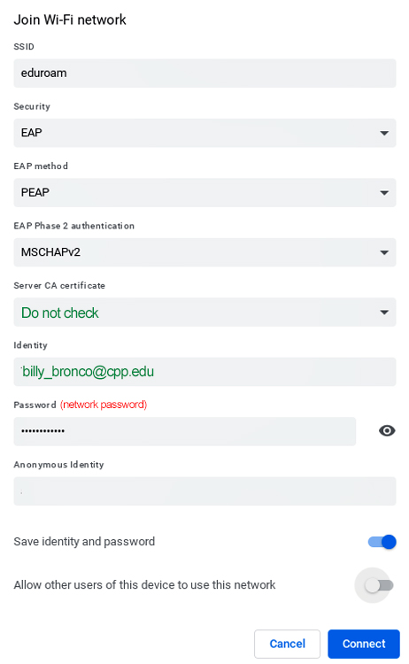

# NSFREU2022-Mobility-Scooter

## Summary
This repo is the collection of work and data that was done that has been done for this project thus far.

Overarching goal is to make the steps to create a multi-modal model that is capable of predicting the a binary/percentage riskiness if an individual should use a Mobility Scooter. The multi-modal would contain accelerometer, gyroscope, and heart rate data.

## GitHub Organization
All documentation for each folder is written into this README.md

## Equipment used for Data Collection
### Cameras
Used 2 Raspberry Pi 4 models with sensor hat to collect Accelerometer and Gyroscope Data
In the NSF REU, we referenced the 2 Raspberry Pis as **"Raspberry Pi A"** & **"Raspberry Pi B."** \
Raspberry Pi A is the one that was placed on the front part of the Mobility Scooter, while
Raspberry Pi B was placed on the back part of the Mobility Scooter (Photo References of each one)\
**NOTE: we referenced this in the data collection. As descriptions of files have an *A* or *B* in it.**

Used 2 Action Cameras (bootleg "GoPros") and a phone camera attached to a gimbal.
- One Action Camera is used on the side view. Using a clamp that is attached to a part of the
arm rest (Image for reference). \

- The Helmet View Action Camera has a band that can be put on and angled in a way to see the
drivers hands and steering wheel.
- Phone Camera used as a front view. Attached to a gimbal to get the phone camera to follow the
body of the driver. (Individuals like leaning on one of the armchairs or like to move side to side)
  - A Gimble "is a pivoted support that permits rotation of an object about an axis" (Google)
    - Name of Gimble we used: **DJI OM5**
      - NOTE: Can use a different brand. Just referencing what gimbal used

**Essential Camera would be the Helmet View where it shows the hands and the handle that
allows a person to use to label the CSV files**

The other two cameras are used for kinesiology group to identify driver body movement. Included these cameras to just prep for the data collection. Not really using it yet in the models (They asked for a front
and side view of driver so we made it possible to do these recordings).

### Raspberry Pi
Have 2 Raspberry Pis: **Raspberry Pi A & Raspberry Pi B**

**Raspberry Pi A** is the Pi mounted to the front section of the mobility scooter\
**Raspberry Pi B** is the Pi mounted to the back section of the mobility scooter

Each Raspberry Pi has its own portable battery. Although Raspberry Pi B shares the battery
with wireless router. Everything can be attached to the mobility scooter with velcro except
wireless router.

# Extracting recordings from Action Cameras
Will need a micro SD card reader. In the supplies there are 2-3 micro SD card readers, but
they are flimsy and one of them does not work well. I recommend using a personal one to read
the micro SD cards from the Action Cameras.

We made use of the School's personal One Drives. (If you need access of the recordings 
from REU 2022, please contact Dr. Chen. She can forward you to owner of the one drive
containing the recordings)

## Details of Data Labeling

1. To prep the raspberry pis to enable them to run code, need to open thonny and open up the
accelerometer.py file in the raspberry pi

- Raspberry Pi A accelerometer.py is in desktop>Code
- Raspberry Pi B accelerometer.py has been reset and need to input RaspberryPiCode.py from this repo
into this Pi.

2. Then change the name of the csv file name (around line 12 of the code) to the current day and
run number that you are doing data collection. Then run the code. The code makes use of the
8x8 grid ontop of the raspberry pi to indicate where it is.
- Green = Data Collecting
- Red = Stopped Data Collecting
- Blue = Ready to Data Collect
- Yellow with exclamation marks = Didnt change csv file name

3. After running code, it should turn blue to indicate it's ready to start. Then when actually
ready flick the joystick knob on the raspberry pi up to start data collecting. Then to stop it
ctrl+c

For the data collection, would mount two raspberry pis differentiated and named as "Raspberry Pi A"
& "Raspberry Pi B." Raspberry Pi A refers to the raspberry pi put at the front of the mobility scooter. While 
Raspberry pi B refers to the raspberry pi put onto the back of the mobility scooter. How we
attached it to the mobility scooter is velcro on the raspberry pis and on the mobility scooter.
Also a seperate velcro spots where the portable batteries are mounted too. **NOTE:** For the 
wireless router, we simply taped it ontop of the portable battery that is on the back of the
mobility scooter.

# Data Preprocesssing/Labeling Instructions

For the Data Collection preprocessing work, we will want to get the raw data and get the mean of every 2 rows. We combine every 2 rows as we collect 2 samples per second and from mimicing the work of a kaggle dataset for driving behavior where they also got the mean and collected 2 samples per second.

Steps:
1. Extract the CSV Files to whatever day you are trying to start preprocessing. Can do this with installing the github desktop and using the external editor to grab specific CSV files. (There is likely a better method to extract specific files, but this seems to work for Marc)
2. Extract the video(s) that correspond to what CSV file(s) that you are planning to preprocess. Will use the video(s) to help label the data with 5 class labels: 

- *Sudden Acceleration* (1)
- *Sudden Right Turn* (2)
- *Sudden Left Turn* (3)
- *Sudden Break* (4)
- *Normal* (5)

3. Create a table in app (ex: excel, doc, word, etc) with label (1 Sudden Acceleration) (2 Sudden Right) (3 Sudden Left) (4 Sudden Break) (5 Normal) 

4. Watch the entire video that correspond with the specific run, 
    1) Record the time stamp of each abnormaties under corresponding labels
    2) Record the time it takes for the Rasberry Pi to be turned on (Ex: after video starts, it takes 15 seconds until the Rasberry Pi starts)
    3) Record the starting time (where the scooter starts moving forward)
    4) Record the ending time (where the scooter completely stops)
    5) Record the time of segments where the direction or labeling will be unclear (Ex: Moving backwards, unsure if driver did a left or sudden left, etc)

5. Prepare for labeling 
    1) Copy and paste the CSV data into the data template (in Processed CSV Files folder) 
    2) Select the columns (Row #	acc_x	acc_y	acc_z	gyro_x	gyro_y	gyro_z	datetime	IGNORE	Elapsed) and drag them down to bottom of data set
    3) Add a 5 under the Labels and drag it down until the end of the data set
    4) Double click the function under Elapsed Time label and add the time it takes for Rasberry Pi to be turned on at the end of the function (Ex: If it takes 15 seconds for the Rasberry Pi to be started, at the function make =OFFSET(Q2,ROW(I2)-1,0) into =OFFSET(Q2,ROW(I2)-1,0)+15)
    5) Delete or grey out the extra labels at the start (from start of Rasberry Pi to the start of scooter moving) 
    6) Delete or grey out the extra labels at the end (from the moment scooter completly stops to the end of the data set)
    7) Delete or grey out the segments of labels where the labeling will be unclear based on step 4 

6. Label the labels column with corresponding numbers based on time stamp from table made in step 3 and elapsed time (Ex: In table it says a sudden left from 78 seconds to 82 seconds, label 3 from 78 to 82) 
    1) Round down if elapsed time is a decimal
    
7. Save the finished CSV file and upload it into the Procssed CSV Files folder name it **PR_[Original Name].csv**

## Extracting Heart Rate Data
- Used Polar H9 Heart Rate Sensor
- Make an account with Polar then go to [Diary](https://flow.polar.com/diary)  sub-section.
In this section it allows you to go to individual runs and extract csv
- NOTE: csv will give extra details too\
**ALTERNATIVE METHOD**
- Follow this [link](https://support.polar.com/en/how-to-download-all-your-data-from-polar-flow
) for instructions
- After downloading zip file, use [HeartRate.py](https://github.com/MarcCruzs/NSFREU2022-Mobility-Scooter/blob/main/code/HeartRate.py)
to convert json file to csv file

## Data Folder
- Data Folder contains all csv files that were used to output accelerometer, gyroscope, and heart rate data.
- Two Folders containing NSF REU csv files and a Kaggle Dataset csv file.
  - *[NSF REU Folder](https://github.com/MarcCruzs/NSFREU2022-Mobility-Scooter/tree/main/Data/NSF%20REU%202022%20Data%20Collection)* is organized by each day data collection occurred. Each Date Folder contains the corresponding csv files that were recorded that day and details on who was driver that day
  - *[Kaggle Dataset Folder](https://github.com/MarcCruzs/NSFREU2022-Mobility-Scooter/tree/main/Data/Kaggle%20Driving%20Behavior%20Dataset)* is just one combined dataset of all featured csv files that were given in the dataset. (Go to folder for more details)
  
## Code Folder
- Contains all code used in the NSF REU 2022. 

# Code
All the python files should be documented. Although some files are better documented than others, so I suggest going through LSTM.py and GRU.py if looking for better understanding of the Machine Learning code. The RaspberryPiCode.py is what was used for the raspberry pi 4 and sensor hat to allow it to collect Accelerometer and Gyroscope X, Y, and Z axis.

- The [**LSTM**](https://github.com/MarcCruzs/NSFREU2022-Mobility-Scooter/blob/main/code/LSTM.py)
and [**GRU**](https://github.com/MarcCruzs/NSFREU2022-Mobility-Scooter/blob/main/code/GRU.py)
used a [CSV file](https://github.com/MarcCruzs/NSFREU2022-Mobility-Scooter/tree/main/Data/Kaggle%20Driving%20Behavior%20Dataset) from a [Kaggle Dataset](https://www.kaggle.com/datasets/shashwatwork/driving-behavior-dataset) on driving behavior.
Both python scripts are two different machine learning models using the same csv file.
- [**ClassLabelFilter.py**](https://github.com/MarcCruzs/NSFREU2022-Mobility-Scooter/blob/main/code/ClassLabelFilter.py)
can be used to filter labelled csv files to separate the labels into 5 csv files that correspond to each class label (Sudden Acceleration, Sudden Left Turn, Sudden Right Turn, Sudden Break, and Normal). 
- [**RaspberryPiCode.py**](https://github.com/MarcCruzs/NSFREU2022-Mobility-Scooter/blob/main/code/RaspberryPiCode.py)
is used in thonny python IDE in the raspberry pi 4 with sensor hat that allows recording of Accelerometer and Gyroscope data 
- [**HeartRate.py**](https://github.com/MarcCruzs/NSFREU2022-Mobility-Scooter/blob/main/code/HeartRate.py) used to 
convert and organize json file for Polar H9 heart rate sensor. At the moment the Polar heart rate sensor has
a way to quickly export a csv file without the need for this code. If anything this is more if you can only
extract json file and not the csv file then use this code. 

# Machine Learning Models
Wanted to clarify a couple of issues that is happening with the models
First issue is that labels were distinguished with numbers 1-5 when we were labeling the
data, but the models start counting at 0. So instead of a output layer's nuerons equal
to the amount of features it also added an extra layer. Although this did not seem to stop
the model from working as intended, it becomes a nuisance when you make the confusion model
that REQUIRES the labelling to start from 0. So in other words, **when you label start from
0 and not 1 if you mimic the way I made my models.** If you also try to use older data,
it has flaws in labels relating to sudden acceleration and would need to fix the labeling as
it was 1-5 not 0-4.

Another thing to note, **Tensorboard**. The models can be handy and gives decent images of
density of data, but if you are CPP student using onedrive on your computer then have to put 
files in a place where the CPP OneDrive is not in the file pathway.

## Router Info
- Explains how to use the router and how it was used to connected to Raspberry Pis to do
VNC viewer

## Raspberry Pi 4 to EDUROAM Folder
- Instructions to get EDUROAM wifi onto the Raspberry Pi 4

# Connecting Raspberry Pi 4 to the CPP EDUROAM wifi

1. First follow steps indicated in the [word doc](https://github.com/MarcCruzs/NSFREU2022-Mobility-Scooter/blob/main/Raspberry%20Pi%204%20to%20EDUROAM/WiFi-eduraom-set-network-password.docx)
2. Then follow the steps from this [website](https://autottblog.wordpress.com/raspberry-pi-arduino/connecting-raspberry-pi-to-eduroam/)

Should be able to get access now
---

# Router info and Future works in Data Collection #

****Router Name : "GL-AR300M-eea-NOR"****

****Password: "goodlife"****

****Software to access the two Rasberry Pi: "VNC Viewer"****

For us to collect data of the gyroscope and accelerometer from the raspberry pi + sensehat
the way we can connect is to use a remote-controlled desktop software so that we can 
access in real-time of the raspberry pi desktops to check if the code is running, 
collecting data and to modify the code
all at the same time. But it needs a common access point or common network that allow 
each system to show their IP address. The wireless router makes this stuff easy by 
allowing us to connect the two raspberry pis without any ethernet cable, any traces 
of bandwidths, and will not need a portable monitor.\
**NOTE: Can be decently far from raspberry pis. Max distance is around 75 meters - 100 meters.**
## Quick tutorial to VNC Viewer ##

Download the [VNC Viewer](https://www.realvnc.com/en/connect/download/viewer/) and register for an account, once login insert the IP address. If you guys started with a new raspberry pi, please modify the bios system that would enable the VNC viewer. For one to access the bios system of raspberry pi you need to open the terminal and type "-sudo su" and them type "raspiconfig" when you're in the bios system go directly to VNC viewer options.  If those command lines doesn't work please watch this tutorial (https://youtu.be/IfzBPi4FHpI).

## Connecting Raspberry Pis to VNC Viewer
After connecting to the wireless router wifi, go to VNC viewer software on laptop or phone and type
in IP addresses:

_Raspberry Pi B: 192.168.8.150_\
_Raspberry Pi A: 192.168.8.237_

If these IP addresses do not work. Go to the command line and hostname -I and that should give
the address when connected to the router wifi.
**NOTE: Laptop can log into both raspberry pi desktops at the same time, while the phone can
only do it one at a time**

## Failed Attempts: ##

We tried our attempts on using the "Eduroam" and "CPPGuest" as our common 
network/accesspoint but this doesn't allow us to use the remote-controlled desktop 
software due to IT protocols in the campus. Stacking onto this problem, it doesn't 
allow us to show IP address. We tried contacting the IT department and creating a 
ticket on their upper management and labeled it as a "high priority" but this takes 
alot of time that can be used in data collection. More likely they will not give us a 
green light to use any of this stuff. (View Future Works. This can be resolved faster during
the semester)\

We used a hotspot as an alternative from the router. This created complications in the 
data collection, firstly hotspot aren't stable hence can't be trusted to be "on" 
all the time and if the phone who started the hotspot needs to be near the two 
raspberry pi and to see the if those two are running you need to have either a 
phone or laptop to view them to be connected and near the hotspot. This attempt challenged 
our physical capabilities to jog or run near the mobility scooter in long amount of time. 

## WARNING: Things to Keep in Mind ##

First of all please do not change the wifi's name that resembles to our association or anything that mentions this Research or any of your guys' name. They have protocol that doesn't allow one student to have a private router, this was mentioned to one of the emails that Dr.Chen's email that IT people have this kind of rules. Please check the IT protocols to see some loopholes.

I haven't tried this attempt due to my anxiety that it may trigger one of the IT protocols and to create things complicated for the future researchers, but I had a brute force/backdoor method to make the "Eduroam" as common network by replicating one of the computers around the CS lab and your system private IP address, you can copy those IP address and change those two  raspberry pi IP address to it. This will make some ease but we haven't see how stable "Eduroam" is in college campus ground and with the alot of people showing up in this upcoming semester.

Invest spare time on automation that sends out csv files in one cloud storage system or discord. Discord bot is one of the attempts I have doing but didn't got the time to it due to data processing and catching up the paper works in my research program.

https://docs.google.com/document/d/1hl65HeF4huXwYAs16MPh2f4Kte3bt-E79pvwCwHbuqg/edit?usp=sharing
